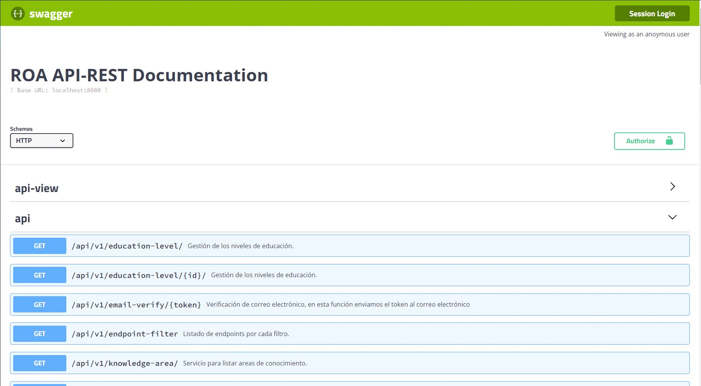

# Repositorio de Objetos de Aprendizaje (ROA) 

Este proyecto es la parte Frontend del <a href="https://repositorio.edutech-project.org/#/">Repositorio de Objetos de Aprendizaje</a> que tiene como finalidad, almacenar objetos de aprendizaje, ver metadatos de accesibilidad, evaluar los metadatos y evaluar los objetos de aprendizajes subidos por cada profesor.

## Empezar 🚀

Estas instrucciones te permitirán obtener una copia del proyecto en funcionamiento en tu máquina local para propósitos de desarrollo y pruebas.

<ul>
 <li>
  <a href="https://github.com/EduTech-Erasmus-Project/Repositorio-Backend.git">Backend repositorio de objetos de aprendizaje (ROA)</a>
 </li>
</ul>

### Pre-requisitos 📋

- Node JS y npm

  <a href="https://nodejs.org">Node JS</a>

- Angular CLI

```
npm install -g @angular/cli
```

### Instalación 🔧

_Este proyecto esta generado con <a href="https://angular.io/cli">Angular CLI</a> versión 11.0.0_

- Descargar las dependencias del proyecto

   Ejecute este comando dentro del directorio raíz del proyecto.

```
npm install
```

   sino funciona

```
npm install --force
```

- Servir aplicación localmente 
```
ng serve
```
- Navegar hacia 

```
http://localhost:4200/
```

## Despliegue 📦

- Para compilar el proyecto

```
ng build --prod
```
- Los archivos de compilación se almacenarán en el directorio `dist/`. Use el comando `--prod` para una compilación de producción.

## Servicios que consume la aplicación 📝

### Configuración de las variables de entorno locales

```
export const environment = {
  production: false,
  baseUrl: 'http://localhost:8000/api/v1',
};
```

### Configuración de las variables de entorno en producción 

```
export const environment = {
  production: true,
  baseUrl: 'https://repositorio.edutech-project.org/api/v1',
};
```

# Documentación API-REST que consumen los servicios 📋

- Todos los servicios que consume el frontend están documentados en la siguiente herramienta `swagger`. 

<p align="center">

</p>
 
- La documentación del API-REST es generada por la herramienta `swagger`, para visualizar la documentación en el servidor local diríjase a la siguiente dirección `http://localhost:8000/api-view`. Para ver la documentación de la aplicacion de producción visite la siguiente dirección <a  href="https://repositorio.edutech-project.org/api-view">https://repositorio.edutech-project.org/api-view</a>
